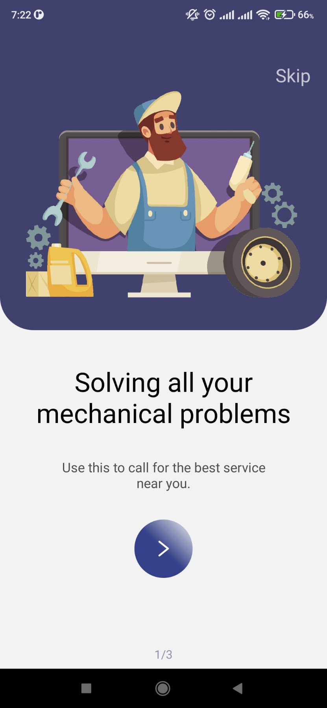
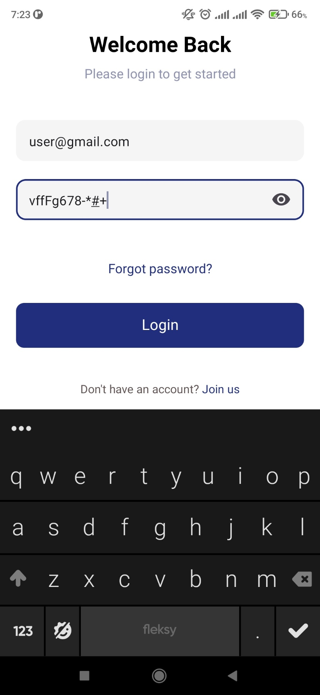
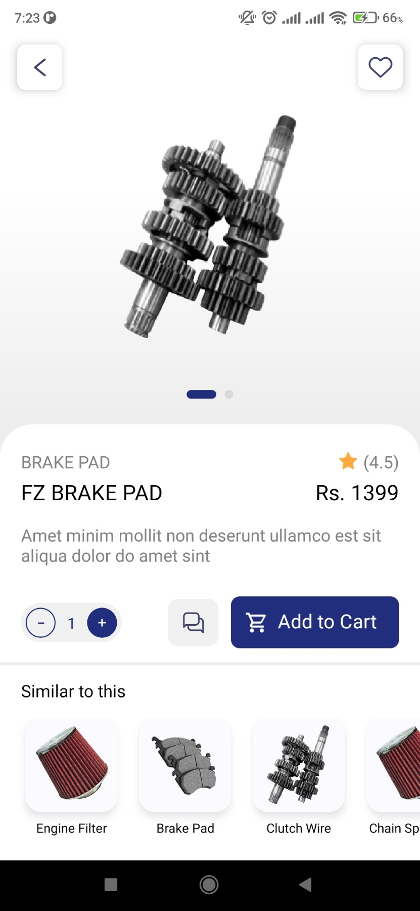
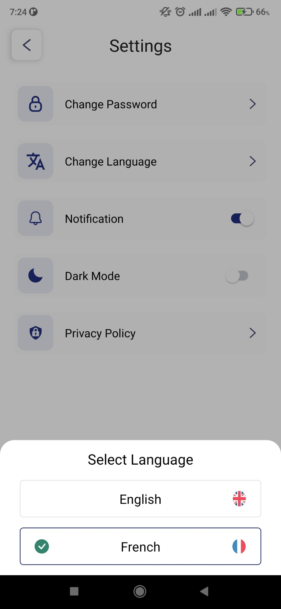
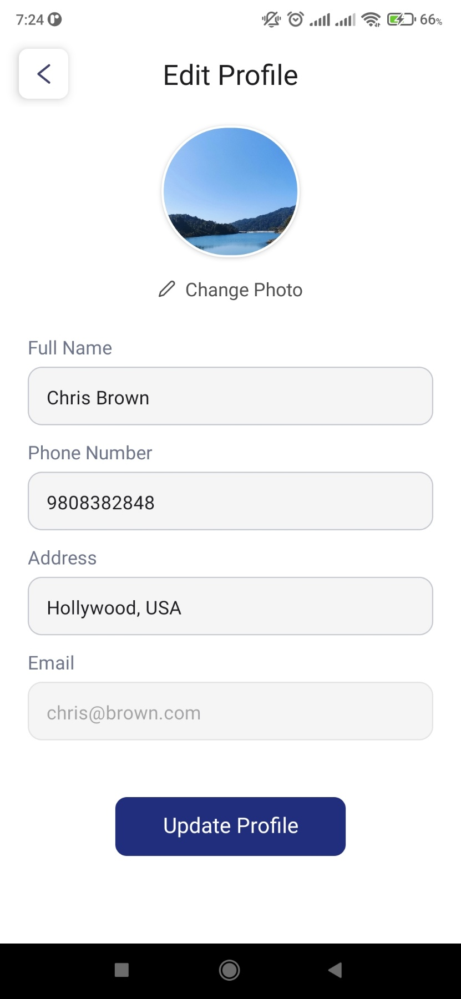

# [E-Mistiri](https://www.youtube.com/watch?v=X-eR-kifqV8&list=PLQbZzpTA-bZDoiByLajTu4x0zM3t4jJCh&index=4&t=185s)

An E-Commerce app developed using React Native CLI for Android.  
Used `npx react-native init` to initialize the project.

# Table of Contents

- [Download APK](#download)
- [App functions](#app-functions)
- [Editor Setup](#editor-setup)
- [Development Setup](#development-setup)
- [App Screenshots](#app-screenshots)

# Download

Try out the app on [Android](https://drive.google.com/drive/folders/1z4aPFQxFIPtgH6CS-2CNQ9QmewhIFJLJ?usp=sharing). Latest version is the one with highest number. The login screens are validated with pattern only, so you can login with any random valid email and password.

# App Functions

A user is able to:

- Create a new account
- Log in to an existing account
- View a list of products in dashboard/shop screen
- Interact via buttons and input fields
- Add products to their cart
- View and update personal information

# Editor Setup

```
- Prettier
- Code Spell Checker
- ESLint
- commitlint
```

# Development Setup

### Prerequisites

```
- Node.js | NPM | NVM
- Android SDK
- JDK v11 (as mentioned in the docs)
- Gradle v7.5.1
- Visual Studio Code
- React Native Debugger
```

Run following commands from project root directory to get up and running with development.

### 1. Install dependencies

`npm install`

### 2. Use node version specified in .nvmrc

`nvm use`

### 3. Start react native metro bundler

`npx react-native start` || `npm start`

### 4. Build the app on android

`npx react-native run-android` || `npm run android`

# App Screenshots











