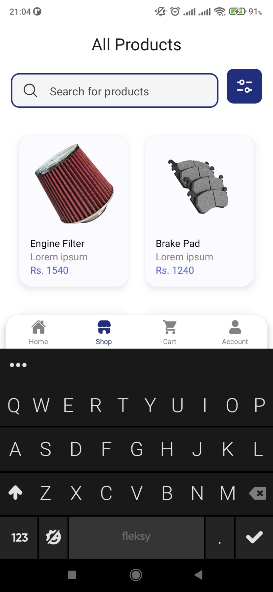
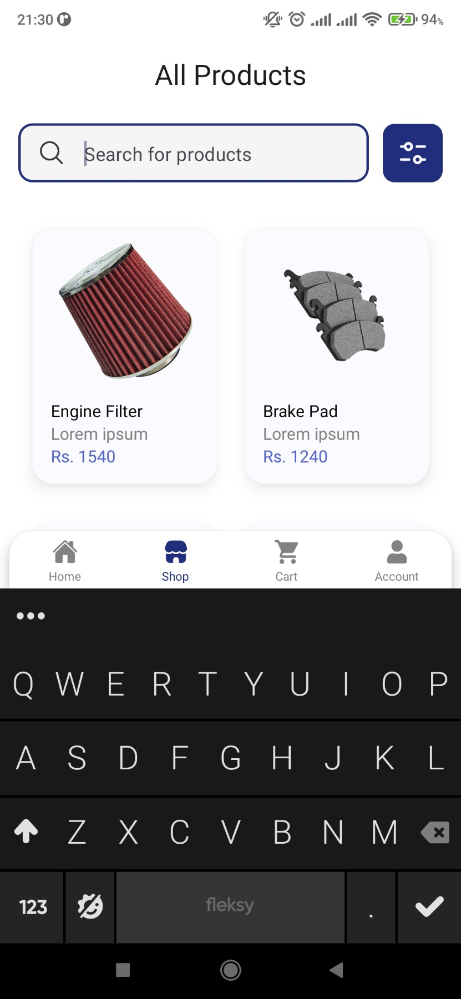

# E-Mistiri

An E-Commerce app developed using React Native CLI for Android.  
Used `npx react-native init` to initialize the project.

# Table of Contents

- [App functions](#app-functions)
- [Editor Setup](#editor-setup)
- [Development Setup](#development-setup)
- [App Screenshots](#app-screenshots)

# App Functions

A user is able to:

- Create a new account
- Log in to an existing account
- View a list of products in dashboard/shop screen
- Interact via buttons and input fields
- Add products to their cart
- View and update personal information

# Editor Setup

```
- Prettier
- Code Spell Checker
- ESLint
- commitlint
```

# Development Setup

### Prerequisites

```
- Node.js | NPM | NVM
- Android SDK
- JDK v18 (or above)
- Gradle v7.5.1
- Visual Studio Code
- React Native Debugger
```

Run following commands from project root directory to get up and running with development.

### 1. Install dependencies

`npm install`

### 2. Use node version specified in .nvmrc

`nvm use`

### 3. Start react native metro bundler

`npx react-native start` || `npm start`

### 4. Build the app on android

`npx react-native run android` || `npm run android`

# App Screenshots






